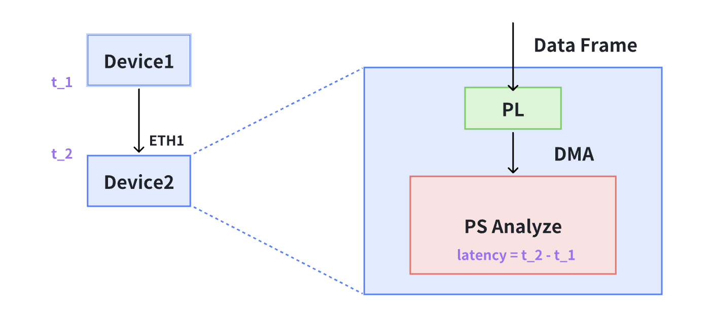
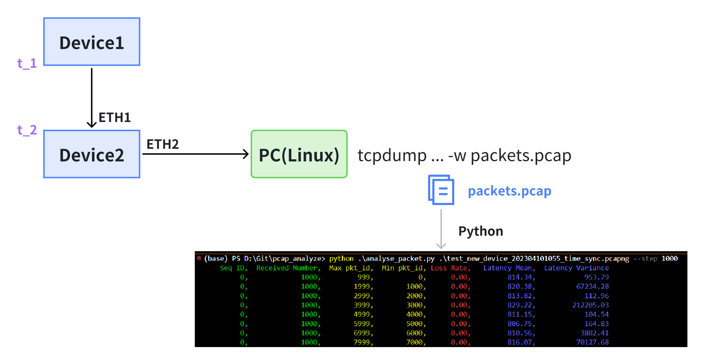

There are two analysis methods for ZIGGO Device:

> Hint: If you want to use offline anaylze, please switch branch to 'offline_anaylze', and you need to link device to anthor PC(linux) by wire.

One method is to `directly` analyze latency and jitter on the ZIGGO Device. The advantage of this method is that it is convenient and fast. We can directly count the latency and jitter of all received data frames on the Device. However, due to the limited processing power of the development board CPU, when analyzing a large number of data packets (such as sending more than 10 1500B data packets at a time with a cycle of 33ms), packet loss may occur;



Another method is to use Device to stamp the received packet and forward it from another port to a powerful desktop computer for packet capture analysis. Even if entering the Device at a gigabit rate, there will be no packet loss. The disadvantage is that a separate program needs to be written offline to analyze the delay and jitter of the packet.



## ZIGGO Device directly analyzes latency and jitter

During the operation of the  `time sync` program, after receiving the test data frame, the program will save the delay information of the data frame in the package under the `build/packet_log.csv` file, save the batch statistics of latency and jitter in the critical directory under the build directory at the same time in the `build/critical_log.csv`.

Example of `packet_log.csv`:

```
Seq ID, Pkt ID, TX timestamp, RX timestamp, Latency
0101, 0, 12683587446, 12683613722, 26276
0101, 1, 12683599662, 12683625970, 26308
0101, 2, 12683611862, 12683638162, 26300
0101, 3, 12683624078, 12683650386, 26308
0101, 4, 12717142039, 12717168273, 26234
0101, 5, 12717154223, 12717180465, 26242
0101, 6, 12717166391, 12717192625, 26234
0101, 7, 12717178575, 12717204825, 26250
0101, 8, 12750696471, 12750722712, 26241
0101, 9, 12750708655, 12750734904, 26249
```

Example of `critical_ log.csv`, where Latency Variance is the variance of Latency:

```
Seq ID, Received Number, Max pkt_id, Min pkt_id, Loss Rate, Latency Mean, Latency Variance
0101, 1000, 0, 999, 0.000000,  26230, 1199
0101, 1000, 1000, 1999, 0.000000,  26218, 2811
0101, 1000, 2000, 2999, 0.000000,  26218, 2808
0101, 1000, 3000, 3999, 0.000000,  26195, 18331
0101, 1000, 4000, 4999, 0.000000,  26233, 921
0101, 1000, 5000, 5999, 0.000000,  26226, 852
0101, 1000, 6000, 6999, 0.000000,  26226, 5080
0101, 1000, 7000, 7999, 0.000000,  26250, 105272
0101, 1000, 8000, 8999, 0.000000,  26204, 7233
0101, 1000, 9000, 9999, 0.000000,  26205, 7361
```

You can display the content of the header and the last 5 lines using the following command:

```bash
cat critical.log | head -n1
cat critical.log | tail -n5
```

## Offline analysis of latency and jitter

If conducting offline analysis, it is important to note that the hardware used is located at `offline_analyze` branch. This version will stamp the key data with a receive timestamp and forward it from ETH2. We need to use a PC equipped with a Linux system to capture packets for analysis.

Example of packet capture command:

```bash
sudo tcpdump -i enx207bd272812b ether src 00:0a:35:00:00:14 -n -B 100000 -w packets.pcapng
```

`Enx207bd272812b` is the name of the network card, which can be obtained through ifconfig. `Src` is used to specify that the captured packet comes from a certain MAC address. `-B` is used to specify the buffer size. If packet loss needs to be set to a larger size, you can check the information output after packet capture to see if Dropped by kernel: is 0. If it is not 0, it indicates that there is packet loss in the kernel. `-W` specifies the path to save the file.

Code for analyzing programs is `analyze_packet.py`

```bash
python .\analyze_packet.py [capture file path] --step [interval]
```

At the same time, a packet will be generated in the current directory (`packet_log.csv` and `critical_log.csv`).
